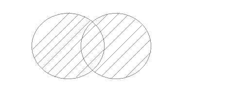
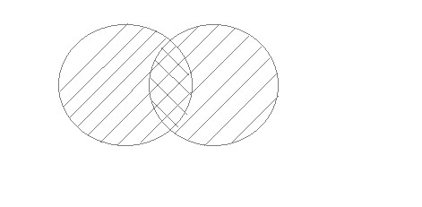
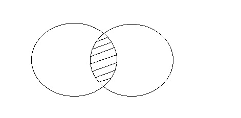
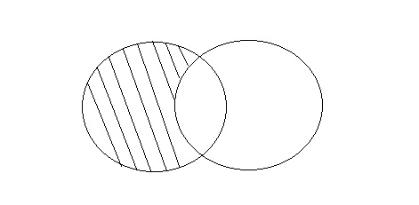
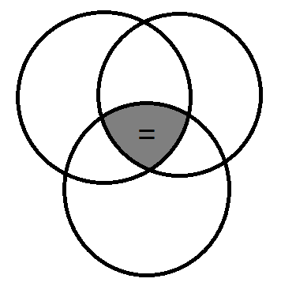

# Querying Relational Databases

## Database Normalization

In this stage, we will explore what a relational database is, why we structure databases in this way, and talk a little bit about the benefits relational databases.

**Why do we need "relational" databases"?**   

Introducing the concept of "relational" databases. 

If you’d like to learn more about Relational Databases, here are a few handy links:

- [Wikipedia: Relational Databases](https://en.wikipedia.org/wiki/Relational_database)
- [Relational Database Design](http://www3.ntu.edu.sg/home/ehchua/programming/sql/relational_database_design.html)

Learn the process of database normalization, which is the process of eliminating redundant or repeating data in a database.

There are hundreds of sites that go into normalization to varying degrees.
Some of the ones we like are:

* [Wikipedia: Database Normalization](https://en.wikipedia.org/wiki/Database_normalization)
* [Study Tonight: Database Normalization](http://www.studytonight.com/dbms/database-normalization.php)
* [Essential SQL: Database Normalization](http://www.essentialsql.com/get-ready-to-learn-sql-database-normalization-explained-in-simple-english/)

Normalization eliminates the potential for update anomalies and the enforcement of data integrity. But what does that mean?

As with most IT topics, there are many books available on the subject. This is a good book for beginning database designers:
[Beginning Database Design Solutions, by Rod Stephens](http://www.amazon.com/Beginning-Database-Design-Solutions-Stephens/dp/0470385499)

Good for: 

* Eliminates data modification anomalies and increases data integrity
* ​

### Set Theory and Relational Databases

Now that we understand a little bit about what Relational Databases are and why we structure them the way we do, let’s take a higher-level look at how to think about data.

[Introduction to Set Theory](http://www.mathsisfun.com/sets/)

**Set Theory** was founded in 1874, and is a relatively new mathematical discipline, as compared to Algebra or Calculus.
For more history and info about the topic, check out the [Wikipedia page on Set Theory](https://en.wikipedia.org/wiki/Set_theory)

This link takes a look at [Set Operations in SQL](http://www.studytonight.com/dbms/set-operation-in-sql.php), but we’ll be covering this more in a later stage.

#### Set Operation in SQL

SQL supports few Set operations to be performed on table data. These are used to get meaningful results from data, under different special conditions.

##### Union

UNION is used to combine the results of two or more Select statements. However it will eliminate duplicate rows from its result set. In case of union, number of columns and datatype must be same in both the tables.



**Example of UNION**  

The **First** table,

| ID   | Name |
| ---- | ---- |
| 1    | abhi |
| 2    | adam |

The **Second** table,

| ID   | Name    |
| ---- | ------- |
| 2    | adam    |
| 3    | Chester |

Union SQL query will be,

```sql
select * from First
UNION
select * from second 
```

The result table will look like,

| ID   | NAME    |
| ---- | ------- |
| 1    | abhi    |
| 2    | adam    |
| 3    | Chester |

##### Union All

This operation is similar to Union. But it also shows the duplicate rows.



**Example of Union All**  

The **First** table,

| ID   | NAME |
| ---- | ---- |
| 1    | abhi |
| 2    | adam |

The **Second** table,

| ID   | NAME    |
| ---- | ------- |
| 2    | adam    |
| 3    | Chester |

Union All query will be like,

```sql
select * from First
UNION ALL
select * from second 
```

The result table will look like,

| ID   | NAME    |
| ---- | ------- |
| 1    | abhi    |
| 2    | adam    |
| 2    | adam    |
| 3    | Chester |

##### Intersect

Intersect operation is used to combine two SELECT statements, but it only retuns the records which are common from both SELECT statements. In case of **Intersect** the number of columns and datatype must be same. MySQL does not support INTERSECT operator.



**Example of Intersect**  

The **First** table,

| ID   | NAME |
| ---- | ---- |
| 1    | abhi |
| 2    | adam |

The **Second** table,

| ID   | NAME    |
| ---- | ------- |
| 2    | adam    |
| 3    | Chester |

Intersect query will be,

```sql
select * from First
INTERSECT
select * from second 
```

The result table will look like

| ID   | NAME |
| ---- | ---- |
| 2    | adam |

##### Minus

Minus operation combines result of two Select statements and return only those result which belongs to first set of result. MySQL does not support INTERSECT operator.



**Example of Minus**  

The **First** table,

| ID   | NAME |
| ---- | ---- |
| 1    | abhi |
| 2    | adam |

The **Second** table,

| ID   | NAME    |
| ---- | ------- |
| 2    | adam    |
| 3    | Chester |

Minus query will be,

```sql
select * from First
MINUS
select * from second 
```

The result table will look like,

| ID   | NAME |
| ---- | ---- |
| 1    | abhi |

## Database Keys

In this stage, we introduce the concept of "Keys." Without Keys, databases as we know them would not be able to function.

**There are 3 types of Database Keys we will be reviewing in this course:**  

* **Unique Keys** - Unique Keys are specifically configured so that no value can be repeated within it.
* **Primary Keys** - Primary Keys are one of the most important aspects of good database design.
* **Foreign Keys** - Foreign Keys are a column, or columns, that relate records back to the primary key in another table.

1. Primary cannot be NULL
2. There can only be one PRIMARY key but many different UNIQUE keys per row
3. You can modify UNIQUE key but not primary key
4. Primary key can be text or integer as long as it is unique, usually auto-incremented integer

Most of what you will find about Primary Keys will pertain to most or all database platforms, but there may be some minor differences in how they are implemented and how they behave on disk.

There is a lot of information on the Internet about Primary Keys. A quick search will turn up thousands of articles, examples, blog posts, forums and question/answer threads.
Here are a few we like:

* The [Wikipedia page for Primary Keys](https://en.wikipedia.org/wiki/Unique_key) actually redirects to a larger page on Unique Keys.

- [The difference between a primary key and a unique key](http://stackoverflow.com/a/2973573)
- [W3 Schools Various Database Systems](http://www.w3schools.com/sql/sql_primarykey.asp)
- For more info on Unique Keys, [Wikipedia: Unique Keys](https://en.wikipedia.org/wiki/Unique_key) is a good introduction.
- This article from W3 Schools shows [How unique keys are implemented in various SQL database platforms](http://www.w3schools.com/sql/sql_unique.asp)
- Here is an explanation and graphical representation of the [Foreign Key relationships between three tables](http://www.teach-ict.com/as_a2_ict_new/ocr/AS_G061/315_database_concepts/terminology/miniweb/pg13.htm)
- [Wikipedia primer on Foreign Keys](https://en.wikipedia.org/wiki/Foreign_key)
- [Foreign Key examples from W3 Schools](http://www.w3schools.com/sql/sql_foreignkey.asp)


**Foreign key constraints** - db setup where table cannot contain foreign key that does not exist. If there are only 1,2,3 in the other table, it cannot add id of 5. Once a Foreign Key Constraint is created to enforce the referential integrity between two tables, it will NOT insert the data, and will return an error.


## Table Relationships

Relationships in databases help us to describe the way that one tables links or relates to another.

### One to Many

One to Many relationships are by far the most common type of table relationship. There is a wealth of information about One to Many relationships available.
Here are a few of the links we find most helpful:

- [Techopedia: One-to-Many](https://www.techopedia.com/definition/25122/one-to-many-relationship)

- [How to Program with Java: Database Relationships](https://howtoprogramwithjava.com/database-relationships-one-to-many/)

- [Tech Republic: Defining Relationships](http://www.techrepublic.com/article/define-relationships-between-database-tables/)


### Many to Many

Many to Many relationships mean that a record in one table can relate to many other records in another table, and one record from the second table can also relate back to many records in the first table. Resolving Many to Many relationships during the database design process is one of the common steps performed by data architects.

* [Techopedia: Many-to-Many](https://www.techopedia.com/definition/27291/many-to-many-relationship)
* [Wikipedia: Many to Many](https://en.wikipedia.org/wiki/Many-to-many_(data_model))
* [Database Primer: Relationships](http://www.databaseprimer.com/pages/relationship_xtox/)

Requires a **third table** to link the many-many tables. Join table.

### One to One

A “One to one” relationship between two tables means that a row in one table can only relate to one row in the table on the other side of their relationship and vice versa. This is the least common database relationship.

One to One relationships are the least common database relationship. Check out some of the resources listed below to see how and when they are most commonly used.

* [Techopedia: One-to-one](https://www.techopedia.com/definition/25123/one-to-one-relationship)


* [Database Primer: Relationships](http://www.databaseprimer.com/pages/relationship_1to1/)
* [Stack Overflow: Relationships in Databases](http://stackoverflow.com/questions/4751923/difference-between-one-to-one-and-one-to-many-relationship-in-database)

Good example is to extend a table that cannot be changed. Like spreading columns of the same row into two tables.

## Modeling Table Relationships

The models that database designers create are called Entity Relationship Diagrams, because they are intended to model the way tables will eventually relate to each other in the finished database.

In our video on modeling table relationships, we saw some examples of **simple Crow’s Foot notation**. There are actually many combinations of cardinality symbols used in [**Crow’s Foot models**.](http://www.conceptdraw.com/solution-park/resource/images/solutions/entity-relationship-diagram-(erd)/Design_Elements(Crows-Foot-ERD).png)

Also, as with many things in technology and the rest of the world, there are more than one way to do things. There are other types of relationship notation that we didn't get into.

Here are a few:

* [Chen Notation](http://www.vertabelo.com/blog/technical-articles/chen-erd-notation)
* [UML Class Diagrams within Cardinality](https://en.wikipedia.org/wiki/Cardinality_(data_modeling))

## Joining Table Data with SQL

We will be transitioning from mostly theoretical concepts to hands-on application of the concepts we’ve covered in the previous three stages. We will see how to use table relationships to produce query results that combine data from multiple tables.

### Inner join

Inner Joins are the most common type of Joins. Inner joins match records together where values are equal on both sides of the join statement.

INNER JOINs are the backbone of advanced SQL querying. There are literally thousands of books, articles and blog posts with examples and information about SQL joins.

Here are some of the links to help you explore INNER JOINs further:

* [W3Schools Inner Joins](http://www.w3schools.com/sql/sql_join_inner.asp)
* [Wikipedia: Inner Joins](https://en.wikipedia.org/wiki/Join_(SQL)#Inner_join)

In the video, we only showed two tables being joined together, but in reality, you can join in any number of tables.

If all tables are inner-joined together, the resulting data set will contain only rows that match on the specified relationships throughout all tables. The resulting Venn Diagram could get quite complex, and depends on many factors, including number of tables, and relationships used, but could look something like this:



```sql
--version 1: select all where MakeID is the same
SELECT * FROM make 
	INNER JOIN model ON make.MakeID = model.MakeID;

--version 2: only show the MakeName and ModelName:
SELECT MakeName, ModelName FROM make 
	INNER JOIN model ON make.MakeID = model.MakeID;

--version 3: you can ALIAS TABLES just like you can alias columns, and add it to whihc column is from which table making it more explicit
SELECT mk.MakeName, md.ModelName FROM make AS mk
	INNER JOIN model AS md ON mk.MakeID = md.MakeID;

--version 4: add WHERE to the query:
SELECT mk.MakeName, md.ModelName FROM make AS mk
	INNER JOIN model AS md ON mk.MakeID = md.MakeID
	WHERE mk.MakeName = "Chevy";
```

### Outer join

Outer Joins are less common than Inner Joins, but still highly useful.

**Three Types of Outer Joins:**

* Left
* Right
* Full

In this video, we introduced **three** types of Outer Joins, but only showed examples of the **Left Outer Join**. *This is because a few database engines, like SQLite, only support the Left Outer Join*. Most other database systems support all three types.

**Right Outer Joins** are essentially the same thing as Left Outer Joins, but just specified in the opposite direction.

**Full Outer Joins** are functionally different in that you are guaranteed to get all rows from both tables. Full Outer Joins aren’t used as much in application or report coding as Inner and Left/Right Outer Joins, but can come in very handy when doing things like comparing data between two tables that are structurally similar.

Resources:
[W3Schools: Left Joins](http://www.w3schools.com/sql/sql_join_left.asp)
[W3Schools: Right Joins](http://www.w3schools.com/sql/sql_join_right.asp)
[W3Schools: Full Joins](http://www.w3schools.com/sql/sql_join_full.asp)
[Wikipedia: Outer Joins](https://en.wikipedia.org/wiki/Join_(SQL)#Outer_join)

**Left outer join:**  

```sql
--version 1: select all where MakeID is the same even if no model exists yet
SELECT mk.MakeName, md.ModelName FROM make AS mk
	LEFT OUTER JOIN model AS md ON mk.MakeID = md.MakeID;
```

it will get this:

| MakeName | ModelName |
| -------- | --------- |
| Dodge    | Dart      |
| Honda    | Accord    |
| Honda    | CRV       |
| Kia      | Rio       |
| Kia      | Soul      |
| Toyota   | Camry     |
| Toyota   | Sienna    |
| BMW      |           |

 And not this:

```sql
SELECT mk.MakeName, md.ModelName FROM make AS mk
	INNER JOIN model AS md ON mk.MakeID = md.MakeID;
```

| Dodge  | Challenger |
| ------ | ---------- |
| Dodge  | Dart       |
| Honda  | Accord     |
| Honda  | CRV        |
| Kia    | Soul       |
| Kia    | Rio        |
| Toyota | Camry      |
| Toyota | Sienna     |
| Honda  | Element    |

**Count models:**  

```sql
SELECT mk.MakeName, COUNT(md.ModelName) AS NumberOfModels FROM make AS mk
	LEFT OUTER JOIN model AS md ON mk.MakeID = md.MakeID
	GROUP BY mk.MakeName;
```

| MakeName | NumberOfModels |
| -------- | -------------- |
| BMW      | 0              |
| Chevy    | 3              |
| Dodge    | 2              |
| Ford     | 3              |
| Honda    | 3              |
| Jeep     | 2              |
| Kia      | 2              |
| Toyota   | 2              |

**GENERAL DEFINITION**  

```sql
SELECT <columns>
	FROM <table1>
	LEFT OUTER JOIN <table2> ON <equality criteria>
	-- INNER JOIN <table3 ON <equality criteria> -- can be combined with other JOINs
	WHERE <Search criteria>...etc
```

### Cross join

You might be thinking, “What on earth is a Cross Join?” We didn’t cover Cross Joins because they are not very common, but they do serve a purpose. And being able to recognize a Cross Join can actually help you if you’re troubleshooting sometimes.

A **Cross Join** takes each row from the first table and matches it with every row in the second table. This can be useful if you ever need to select all possible combinations of rows from two tables. For instance, if I had two tables with 10 rows each and I cross joined them, I would get a 100 row result set back.

Where this knowledge really comes in handy is if you ever see data that is being duplicated many times over unexpectedly in a query result, you may have done something wrong in your Inner Join that caused the matching criteria to be ignored. It’s a sign to go back and double check that you have the proper equality statement in the **ON** portion of the Inner Join section.

**Resources:**  

[Wikipedia: Cross Joins](https://en.wikipedia.org/wiki/Join_(SQL)#Cross_join)
[W3Schools: Cross Joins](http://www.w3resource.com/sql/joins/cross-join.php)

**Exercise**:

1) In a car database there is 
a `Make` table with columns, `MakeID` and `MakeName`, 
a `Model` table with columns, `ModelID`, `MakeID` and `ModelName` and 
a `Car` table with columns, `CarID`, `ModelID`, `VIN`, `ModelYear` and `StickerPrice`.

For all cars in the database, show Make Name, Model Name, VIN and Sticker Price from the Model and Car tables in one result set.  

```sql
SELECT MakeName, ModelName, VIN, StickerPrice FROM Model
	INNER JOIN Car ON Car.ModelID = Model.ModelID
    INNER JOIN Make ON Make.MakeID = Model.MakeID;
```

2) In a car database there is 

*  `Sale` table with columns, `SaleID`, `CarID`, `CustomerID`, `LocationID`, `SalesRepID`, `SaleAmount` and `SaleDate`. 
* `SalesRep` table with columns, `SalesRepID`, `FirstName`, `LastName`, `SSN`, `PhoneNumber`, `StreetAddress`, `City`, `State` and `ZipCode`.

Show the First and Last Name of each sales rep along with SaleAmount from both the SalesRep and Sale tables in one result set.

```sql
SELECT FirstName, LastName, SaleAmount FROM Sale
	INNER JOIN SalesRep ON SalesRep.SalesRepID = Sale.SalesRepID
```

3) In a car database there is:

* `Model` table with columns, `ModelID`, `MakeID` and `ModelName` 
* `Car` table with columns, `CarID`, `ModelID`, `VIN`, `ModelYear` and `StickerPrice`

Show all Model names from the Model table along with VIN from the Car table. Make sure models that aren't in the Car table still show in the results!

```sql
SELECT ModelName, VIN FROM Model
	LEFT OUTER JOIN Car ON Car.ModelID = Model.ModelID;
```

4) In a car database there is 

* `Sale` table with columns, `SaleID`, `CarID`, `CustomerID`, `LocationID`, `SalesRepID`, `SaleAmount` and `SaleDate`. 
* `SalesRep` table with columns, `SalesRepID`, `FirstName`, `LastName`, `SSN`, `PhoneNumber`, `StreetAddress`, `City`, `State` and `ZipCode`.

Show all SaleDate, SaleAmount, and SalesRep First and Last name from Sale and SalesRep. Make sure that all Sales appear in results even if there is no SalesRep associated to the sale. 


## Set Operations

We cover more SQL operations that allow us to combine data sets from multiple tables in various ways.

Introducing the SQL commands that allow us to perform relatively complex set operations on a database

As with the other topics we’ve covered in this series, there is a wealth of information available on the topic of sets, databases, and SQL.

We'll get into the following topics in this stage, but here are a few links that talk a little more about Set Operations in SQL:

- [What is the difference between a JOIN and a UNION?](https://www.essentialsql.com/what-is-the-difference-between-a-join-and-a-union/)
- [Learn to use UNION, INTERSECT, and EXCEPT Clauses](https://www.essentialsql.com/learn-to-use-union-intersect-and-except-clauses/)

**Other good reads about Set Operations include:**

Union and Union All:

[SQL UNION Operator](http://www.w3schools.com/sql/sql_union.asp)
[SQL - UNIONS Clause](http://www.tutorialspoint.com/sql/sql-unions-clause.htm)

Intersect:

[SQL - INTERSECT Clause](http://www.tutorialspoint.com/sql/sql-intersect-clause.htm)
[SQL Server: INTERSECT Operator](http://www.techonthenet.com/sql/intersect.php)

Except:

[SQL - EXCEPT Clause](http://www.tutorialspoint.com/sql/sql-except-clause.htm)
[SQL Server: EXCEPT](http://www.techonthenet.com/sql_server/except.php)

**Union Operations**  

One of the more common set operations in SQL is the UNION statement. Use to combine two data sets into one, stacked one on top of the other, unlike an inner join which puts data together side by side.

As with the other topics we’ve covered in this series, there is a wealth of information available on the topic of sets, databases, and SQL.

Check out this great read on Set Theory and SQL: [“SQL-99 Complete, Really”, by Peter Guzman & Trudy Pelzer](https://mariadb.com/kb/en/sql-99/set-theory/) hosted on MariaDB.

The link above contains more than just UNION, INTERSECT and EXCEPT, but there is a section towards the end that applies those operations to the larger discussion. This is a wonderful article!

## Subqueries

We introduce the you to Subqueries. Subqueries are a powerful tool that allow us to work with data in smaller subsets, which can greatly increase query performance and efficiency. 

Here we discuss the concepts behind subqueries, and learn how and when we might use them.

Subqueries are one of the most advanced concepts to learn in SQL query writing. Seeing lots of examples and getting lots of practice will help solidify the concept.

[Advanced Subqueries](https://sqlschool.modeanalytics.com/advanced/subqueries/)

**As you begin using subqueries, be advised that a poorly structured subquery written against a large table or tables can impact overall query performance**. Be careful if you are writing subqueries against data sets that consume tables with row counts in the million-plus row range.

**Correlated Subqueries**  

This course does not cover the concept called **Correlated Subqueries**, which are slightly different in how they tie in with the outer query. Most of the time a regular subquery will do what you need, but correlated subqueries can be handy, too. These are especially heavy weight on the database engine, as they run the subquery many times; once per row in the outer query.

[Information on all subquery types including correlated subqueries](http://w3processing.com/index.php?subMenuId=119)